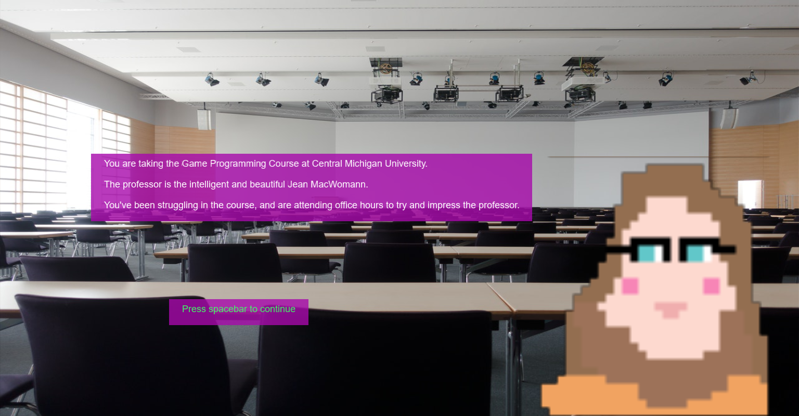

# 15-466 OH Sim

Author: Kyle Jannak-Huang

Disclaimer: This game is purely a work of fiction. The scenes, persons, and dialogue in this game have nothing to do with real life.

Design: 

This game has cringeworthy dialogue, much like a dating sim. However, the catch is that you are at office hours, and trying to get a good grade in your class.
Like many dating sims, this game has multiple endings. See if you can find the best path! Alternatively, see if you can make Jean MacWomann angry, since I only drew two sprites.

Text Drawing: The text is shaped and rendered during runtime. There are no extra files or textures. I take std::strings and use Harfbuzz to shape them,
and FreeType to get the bitmap for each glyph. Then, that bitmap is used to generate a texture for each glpyh with the bitmap as the alpha channel.
The positions for each glyph from FreeType from quads. Thos quads, along with the color and texture coordinates, are put in a vertex buffer as triangles.
The textures are then applied to the quads during drawing.

I based my implmentation on this github example, https://github.com/tangrams/harfbuzz-example/tree/master/src. I left the freetypelib part untouched, but modified
the hbshaper.h to work with color_texture_program and the OpenGL pipeline that I'm used to.

Text is computed only when the text on the screen is changing, so it doesn't slow down the game at all. It also supports dynamic text. 
The problem with this approach is that the text is in different places depending on the window size, and since I used a stock image background,
it can make the text hard to read in some cases. So it's best if you don't resize the window for this game.

Screen Shot:

How To Play:

Use the up and down arrow keys to highlight your choice, and press the spacebar to select it.

Sources: 

I downloaded the background stock image from https://www.pexels.com/photo/white-wooden-rectangular-table-159213/, under this license: https://www.pexels.com/license/.

I used and modified this example of Harfbuzz and Freetype: https://github.com/tangrams/harfbuzz-example/tree/master/src under the MIT license.

I also referenced some of my OpenGL drawing code from this tutorial: https://learnopengl.com/In-Practice/Text-Rendering

The soundtrack:
Blippy Trance by Kevin MacLeod
Link: https://incompetech.filmmusic.io/song/5759-blippy-trance
License: http://creativecommons.org/licenses/by/4.0/

This game was built with [NEST](NEST.md)..

